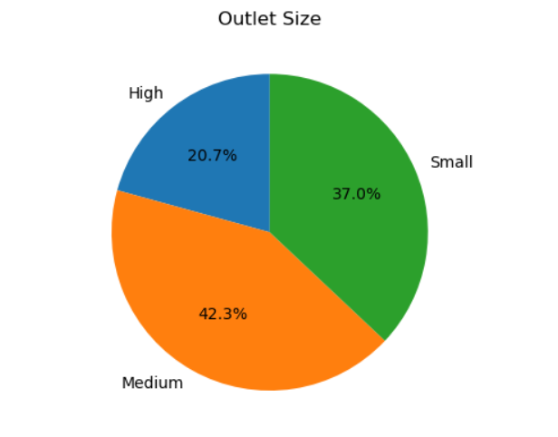

- `blinkit_raw_data.csv` — original raw dataset  
- `blinkit_clean_data.csv` — cleaned / preprocessed version  
- `Blinkit Analysis.ipynb` — Jupyter notebook with the full analysis, visualizations, commentary  
- `images/` — folder containing all chart image files used in the README and notebook  

---

## 🧠 Project Overview

This project follows a typical data analysis workflow:

1. **Data Loading & Cleaning** — load raw data, handle missing values, correct data types  
2. **Exploratory Data Analysis (EDA)** — gain insights through summary stats, distributions, and charts  
3. **Visualization** — create charts (pie charts, bar plots, grids etc.) to visually share findings  
4. **Insights & Conclusions** — observations and potential recommendations  

---

## 📊 Key Visuals

Here are some of the charts and visual summaries produced:

- **Sales by Fat Content**  
  

- **Total Sales by Item Type**  
  

- **Outlet Size Distribution**  
  

- **Combined View (Grid of Charts)**  
  


---

## 🛠️ How to Use / Run

1. Clone the repo:

   ```bash
   git clone https://github.com/Shreyasgit-hubs/Blinkit-data-analysis-python.git
   cd Blinkit-data-analysis-python
